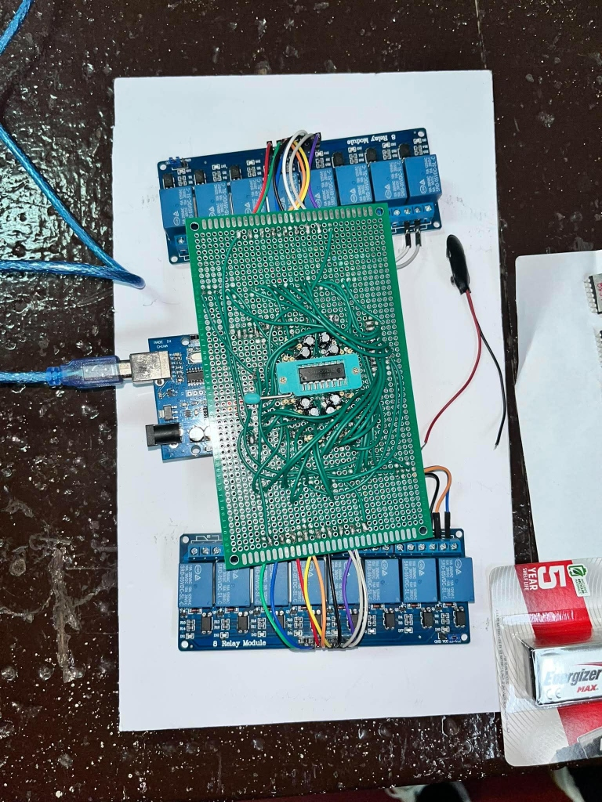

# CD4071 CMOS Quad 2-Input OR Gate Automatic Test Equipment (ATE)

This repository contains the firmware, CLI tool, hardware routing documentation, and automation scripts for a DIY Automatic Test Equipment (ATE) system designed to test and characterize CD4071 CMOS Quad 2-Input OR Gate ICs. The controller runs on an Arduino Mega 2560 interfacing with a custom 14-relay switching matrix.

---

## Hardware Architecture

The system uses a **14-Relay Matrix** to dynamically route VDD, GND, analog sensing, and digital stimulation pins to the CD4071 Device Under Test (DUT).

### Hardware Setup


### Key Design Elements:
1. **Input RC Filters**: Each input channel is equipped with an RC filter capacitor (to control rise times/voltage sweeps). The firmware handles charging and discharging capacitive nodes safely to prevent transient spikes.
2. **Current Measurement Load Resistors**: Output sense channels contain onboard $5\text{ k}\Omega$ load resistors connected to digital driver pins, allowing accurate measurement of output source ($I_{OH}$) and sink ($I_{OL}$) currents.
3. **Power Control**: Relays 7 & 8 control VDD and GND connection modes, supporting safe normal operation and reverse-bias conditions.

### Relay Routing & Pin Mapping

| Relay ID | Relay Type | Arduino Mega Control Pin | Destination Pin / Sense Endpoint | Description |
|---|---|---|---|---|
| **1** | Input | D9 | D44, Analog A3 | Gate 1 Input A1 |
| **2** | Input | D8 | D42, Analog A2 | Gate 1 Input B1 |
| **3** | Output | D16 | D36, Analog A4 & A5 | Gate 1 Output Q1 |
| **4** | Output | D17 | D34, Analog A6 & A7 | Gate 2 Output Q2 |
| **5** | Input | D7 | D40, Analog A12 | Gate 2 Input A2 |
| **6** | Input | D6 | D38, Analog A13 | Gate 2 Input B2 |
| **7** | Power | D19 | GND (IC Pin 7) | Device Ground Connection |
| **8** | Power | D18 | VDD (IC Pin 14) | Device VDD Power (5V) |
| **9** | Input | D5 | D28, Analog A0 | Gate 3 Input A3 |
| **10** | Input | D4 | D26, Analog A1 | Gate 3 Input B3 |
| **11** | Output | D14 | D32, Analog A8 & A9 | Gate 3 Output Q3 |
| **12** | Output | D15 | D30, Analog A10 & A11 | Gate 4 Output Q4 |
| **13** | Input | D3 | D24, Analog A14 | Gate 4 Input A4 |
| **14** | Input | D2 | D22, Analog A15 | Gate 4 Input B4 |

---

## Interactive Serial CLI Commands

When connected over serial at **115200 baud**, the Arduino ATE firmware presents an interactive prompt `ATE> `. The following commands are supported:

| Command | Arguments | Description |
|---|---|---|
| `help` | None | Displays the CLI help menu. |
| `power` | `[on/normal/off/reverse]` | Manages VDD/GND power relays (Normal: VDD=5V, GND=0V; Reversed/Off). |
| `discharge` | `<relay_id (1-14)>` | Safely discharges input capacitor node through $10\text{ k}\Omega$ pull-down. |
| `charge` | `<relay_id> <voltage>` | Step-sweep charges input capacitor to target voltage (0.0 to 5.0V). |
| `read` | `<relay_id>` | Reads and returns the voltage on the specified input capacitor. |
| `readout` | `<relay_id> [nc/no] [load/highz]` | Reads output voltage/current (NC=Analog current-delta, NO=Digital logic). |
| `test gate1` | None | Performs standard truth table and load test on Gate 1. |
| `test gate2` | None | Performs standard truth table and load test on Gate 2. |
| `test threshold2`| None | Runs detailed voltage ramp/threshold sweep on Gate 2. |
| `test ic` | `<batch> <ic_num>` | Runs full characterization sweep for all 4 gates (outputs CSV to console). |
| `test live` | `[gate_num (1-4)]` | Performs a real-time live test of DC parameters, verified against datasheet limits. |
| `verbose` | `[on/off]` | Toggles verbose logging of capacitor charging/discharging and sweep steps. |

---

## Live Testing & Datasheet Limits

The `test live [gate_num]` command tests the DC electrical characteristics of the CD4071 gate at $V_{DD} = 5\text{ V}$ against official manufacturer specifications.

### Real Supporting Information & Datasheet Links
- **[TI CD4071B Official Datasheet](https://www.ti.com/lit/ds/symlink/cd4071b.pdf)**
- **[Harris CD4071B Product Datasheet](https://www.digikey.com/htmldatasheets/production/19965/0/0/1/cd4071b.html)**

### Measured DC Parameters & Specifications ($V_{DD} = 5.0\text{ V}$, $T_A = 25^\circ\text{C}$)

| Parameter | Symbol | Conditions | Min Spec | Typ Spec | Max Spec | Unit | Test Details |
|---|---|---|---|---|---|---|---|
| **Output Low Voltage** | $V_{OL}$ | $V_{IN} = 0\text{ V}$, No Load | — | 0.0 | 0.05 | V | Inputs: A=0V, B=0V |
| **Output High Voltage** | $V_{OH}$ | $V_{IN} = 5\text{ V}$, No Load | 4.95 | 5.0 | — | V | Inputs: $A=5\text{ V}$ or $B=5\text{ V}$ |
| **Input High Voltage** | $V_{IH}$ | Sweep from $0\text{ V}\rightarrow 5\text{ V}$ | 3.5 | 2.75 | — | V | Sweeps up until $V_{OUT} \ge 2.5\text{ V}$ |
| **Input Low Voltage** | $V_{IL}$ | Sweep from $5\text{ V}\rightarrow 0\text{ V}$ | — | 2.25 | 1.5 | V | Sweeps down until $V_{OUT} \le 2.5\text{ V}$ |
| **Output High Source Current** | $I_{OH}$ | $V_{OUT} = 4.6\text{ V}$ ($4.5\text{ V}$ typ) | 0.64 | 2.5 | — | mA | Measured across onboard $5\text{ k}\Omega$ load |
| **Output Low Sink Current** | $I_{OL}$ | $V_{OUT} = 0.4\text{ V}$ | 0.64 | 1.6 | — | mA | Measured across onboard $5\text{ k}\Omega$ load |

> [!NOTE]
> Per hardware design constraints, AC/transient measurements (propagation delays $t_{pd}$, transition times $t_r, t_f$) and quiescent device current ($I_{DD}$) are excluded from this ATE testing routine.

---

## Automation Scripts

### `run_characterization.ps1`
A PowerShell automation script is provided in the root directory to run characterization tests, stream real-time data, and store output values directly to CSV files on your Desktop.

#### Running a Characterization Sweep
1. Open PowerShell and run:
   ```powershell
   ./run_characterization.ps1 -Batch 1 -Sample 2 -PortName COM5
   ```
2. The script will:
   - Establish a serial connection with the Arduino Mega (resets the board using RTS/DTR state toggles to clear boot buffer).
   - Send `test ic 1 2` to the controller.
   - Live stream the sweep steps.
   - Parse and write output data to `C:\Users\Keno\Desktop\CD4071_ATE_Results\Batch_1\Sample_2.csv`.

---

## Compilation & Uploading Firmware

The firmware is located in `firmware/diy_ate_controller/`.

### Prerequisites
Make sure `arduino-cli` is installed. By default, it is located at:
`C:\Program Files\Arduino CLI\arduino-cli.exe`

### Commands

1. **Install platform support**:
   ```powershell
   & "C:\Program Files\Arduino CLI\arduino-cli.exe" core update-index
   & "C:\Program Files\Arduino CLI\arduino-cli.exe" core install arduino:avr
   ```

2. **Compile the sketch**:
   ```powershell
   & "C:\Program Files\Arduino CLI\arduino-cli.exe" compile --fqbn arduino:avr:mega firmware/diy_ate_controller
   ```

3. **Find your COM port**:
   ```powershell
   & "C:\Program Files\Arduino CLI\arduino-cli.exe" board list
   ```

4. **Upload the firmware** (e.g. to `COM5`):
   ```powershell
   & "C:\Program Files\Arduino CLI\arduino-cli.exe" upload -p COM5 --fqbn arduino:avr:mega firmware/diy_ate_controller
   ```
